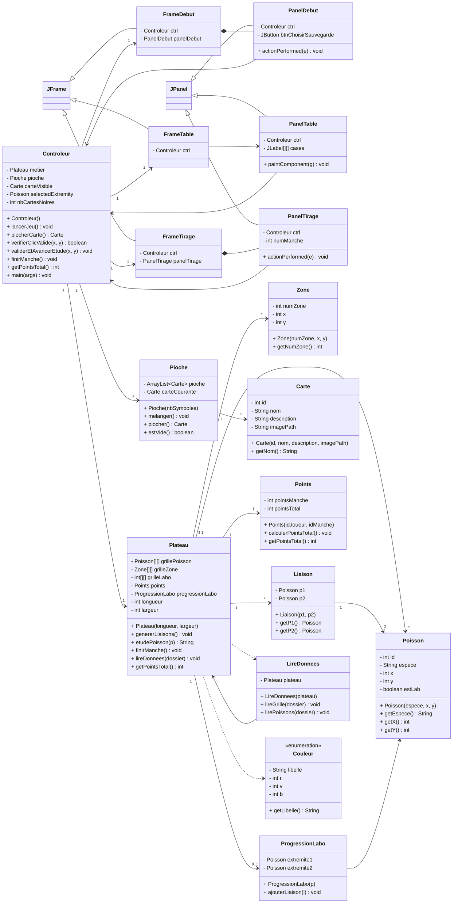

```mermaid
classDiagram
    direction LR

    %% ---------- CONTROLEUR ----------
    class Controleur {
        - Plateau metier
        - Pioche pioche
        - Carte carteVisible
        - Poisson selectedExtremity
        - int nbCartesNoires
        + Controleur()
        + lancerJeu() void
        + piocherCarte() Carte
        + verifierClicValide(x, y) boolean
        + validerEtAvancerEtude(x, y) void
        + finirManche() void
        + getPointsTotal() int
        + main(args) void
    }

    %% ---------- VUE (package ihm) ----------
    class FrameDebut {
        - Controleur ctrl
        - PanelDebut panelDebut
    }
    class PanelDebut {
        - Controleur ctrl
        - JButton btnChoisirSauvegarde
        + actionPerformed(e) void
    }
    class FrameTable {
        - Controleur ctrl
    }
    class PanelTable {
        - Controleur ctrl
        - JLabel[][] cases
        + paintComponent(g) void
    }
    class FrameTirage {
        - Controleur ctrl
        - PanelTirage panelTirage
    }
    class PanelTirage {
        - Controleur ctrl
        - int numManche
        + actionPerformed(e) void
    }

    %% ---------- MODELE (package metier) ----------
    class Plateau {
        - Poisson[][] grillePoisson
        - Zone[][] grilleZone
        - int[][] grilleLabo
        - Points points
        - ProgressionLabo progressionLabo
        - int longueur
        - int largeur
        + Plateau(longueur, largeur)
        + genererLiaisons() void
        + etudePoisson(p) String
        + finirManche() void
        + lireDonnees(dossier) void
        + getPointsTotal() int
    }
    class Poisson {
        - int id
        - String espece
        - int x
        - int y
        - boolean estLab
        + Poisson(espece, x, y)
        + getEspece() String
        + getX() int
        + getY() int
    }
    class Zone {
        - int numZone
        - int x
        - int y
        + Zone(numZone, x, y)
        + getNumZone() int
    }
    class Liaison {
        - Poisson p1
        - Poisson p2
        + Liaison(p1, p2)
        + getP1() Poisson
        + getP2() Poisson
    }
    class Carte {
        - int id
        - String nom
        - String description
        - String imagePath
        + Carte(id, nom, description, imagePath)
        + getNom() String
    }
    class Pioche {
        - ArrayList~Carte~ pioche
        - Carte carteCourante
        + Pioche(nbSymboles)
        + melanger() void
        + piocher() Carte
        + estVide() boolean
    }
    class Points {
        - int pointsManche
        - int pointsTotal
        + Points(idJoueur, idManche)
        + calculerPointsTotal() void
        + getPointsTotal() int
    }
    class ProgressionLabo {
        - Poisson extremite1
        - Poisson extremite2
        + ProgressionLabo(p)
        + ajouterLiaison(l) void
    }
    class LireDonnees {
        - Plateau plateau
        + LireDonnees(plateau)
        + lireGrille(dossier) void
        + lirePoissons(dossier) void
    }
    class Couleur {
        <<enumeration>>
        - String libelle
        - int r
        - int v
        - int b
        + getLibelle() String
    }

    %% ---------- HERITAGE (Swing) ----------
    JFrame <|-- FrameDebut
    JFrame <|-- FrameTable
    JFrame <|-- FrameTirage
    JPanel <|-- PanelDebut
    JPanel <|-- PanelTable
    JPanel <|-- PanelTirage

    %% ---------- RELATIONS Controleur / Vue ----------
    Controleur "1" --> "1" FrameDebut
    Controleur "1" --> "1" FrameTable
    Controleur "1" --> "1" FrameTirage
    FrameDebut *-- PanelDebut
    FrameTirage *-- PanelTirage
    FrameTable --> PanelTable
    PanelDebut --> Controleur
    PanelTable --> Controleur
    PanelTirage --> Controleur

    %% ---------- RELATIONS Controleur / Modele ----------
    Controleur "1" --> "1" Plateau
    Controleur "1" --> "1" Pioche

    %% ---------- RELATIONS dans le Modele ----------
    Plateau "1" --> "*" Poisson
    Plateau "1" --> "*" Zone
    Plateau "1" --> "*" Liaison
    Plateau "1" --> "1" Points
    Plateau "1" --> "0..1" ProgressionLabo
    Plateau ..> LireDonnees
    Plateau ..> Couleur
    LireDonnees --> Plateau
    Liaison "1" --> "2" Poisson
    ProgressionLabo --> Poisson
    Pioche "1" --> "*" Carte
```
